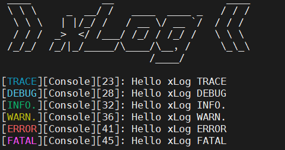
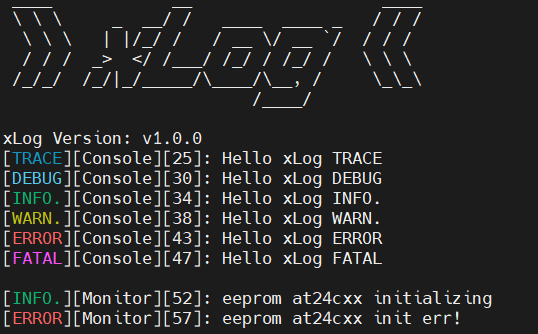

# xLog

 ---

 ## 1. 简介                                    

[xLog](https://gitee.com/H-RHang/xLog) 是一款使用C99实现的`轻量`、`易上手`、 `C` 日志库。

 

 ## 2. 特性

 - 输出格式包括`日志模块`、`级别`、`时间戳`等信息；
 - 支持按`日志模块`、`级别`、`时间戳`进行动态过滤；
 - 日志级别支持不同`颜色`显示。

## 3. 使用

### 3.1 参数配置

xLog 具有静态/动态设置输出格式、输出开关这些属性。

- 静态：使用宏定义，在编译 `xLog.h` 文件时配置
  - 支持的日志模块数量；
    ```c
    #define XLOG_MAX_MOD_NUM    16    /*-- 最大支持的日志模块数量 --*/
    ```
  - 日志开关；
    ```c
    #define XLOG_ENABL          1   /*-- 日志使能 0-失能 / 1-使能 --*/
    ```
  - 日志级别颜色；
    ```c
    #define XLOG_COLOR_ENABLE   1   /*-- 日志使能 0-失能 / 1-使能 --*/
    ```
- 动态：使用API接口，在运行时设置
  - 日志模块开关设置；
    ```c
    void xlogSetEn(S_XLog_Handle logHandle, E_XLog_En_Stat enStat);
    ```
  - 日志输出级别设置；
    ```c
    void xlogSetLv(S_XLog_Handle logHandle, E_XLog_Lv lv);
    ```
  - 日志格式输出设置。
    ```c
    void xlogSetFmt(S_XLog_Handle logHandle, T_XLog_Fmt fmt);
    ```
### 3.2 输出级别

日志输出级别最高为 105(Fatal) ，最低为 100(Trace)。
```
日志等级:
100 [TRACE] 追踪(Trace)
101 [DEBUG] 调试(Debug)
102 [INFO.] 信息(Info)
103 [WARN.] 警告(Warn)
104 [ERROR] 错误(Error)
105 [FATAL] 致命(Fatal)
```

### 3.3 移植
xLog日志库打印需要用户在 `xLog_port.h` 文件提供端口输出功能和时间信息获取。
```c
/**
 * \brief        日志输出端口
 * \param[in]    msg: 日志缓存
 * \param[in]    len: 日志长度
 * \return       0:   日志实际输出长度
 *              -1:  输出失败
 */
int xLogPort(const char *msg, size_t len)
{
	return bspCom4Write((const uint8_t *) msg, len);
}

/**
 * \brief     获取系统运行时间
 * \return    系统时间 ms
 */
uint32_t xLogGetTimestamp(void)
{
	return bspGetSysTick();
}
```

### 3.4 Demo
```c
#include"xLog.h"

void xLogInit(void)
{
    /*-- 初始化 xLog --*/
    memset((void *) &s_XLog, 0, sizeof(S_XLog));

    /*-- xLog 版本 --*/
    xLOG("xLog Version: v1.0.0 \r\n");

    /*-- 打印 xLog Logo --*/
    xLOG(XLOG_LOGO);

    /*-- 创建 Console 日志模块，并输出所有格式 --*/
    g_XlogConsole = xLogCreate("Console", XLOG_FMT_ALL);

    /*-- 创建 ModbusMaster 日志模块，并输出所有格式 --*/
    g_XlogModbusMaster = xLogCreate("ModbusMaster", XLOG_FMT_ALL);

    /*-- 创建 Monitor 日志模块，并输出所有格式 --*/
    g_XlogMonitor = xLogCreate("Monitor", XLOG_FMT_ALL);

    /*-- 使能 Console 日志模块输出 --*/
    xlogSetEn(g_XlogConsole, eXLOG_ENABLE);

    /*-- 设置 Console 日志模块输出级别为Trace --*/
    xlogSetLv(g_XlogConsole, eXLOG_TRACE);

    /*-- 设置 Console 日志模块输出格式开关为: 日志级别 + 模块标签 + 时间戳 + 日志级别颜色 --*/
    xlogSetFmt(g_XlogConsole, XLOG_FMT_LV | XLOG_FMT_MOD_NAME | XLOG_FMT_TIME | XLOG_FMT_COLOR);

    xlogSetEn(g_XlogModbusMaster, eXLOG_ENABLE);
    xlogSetLv(g_XlogModbusMaster, eXLOG_TRACE);
    xlogSetFmt(g_XlogModbusMaster, XLOG_FMT_LV | XLOG_FMT_MOD_NAME | XLOG_FMT_TIME | XLOG_FMT_COLOR);

    xlogSetEn(g_XlogMonitor, eXLOG_ENABLE);
    xlogSetLv(g_XlogMonitor, eXLOG_TRACE);
    xlogSetFmt(g_XlogMonitor, XLOG_FMT_LV | XLOG_FMT_MOD_NAME | XLOG_FMT_TIME | XLOG_FMT_COLOR);

    /*-- 输出 Console 日志模块级别信息 --*/
    xLOG_TRACE(g_XlogConsole, "Hello xLog TRACE \r\n");
    xLOG_DEBUG(g_XlogConsole, "Hello xLog DEBUG \r\n");
    xLOG_INFO(g_XlogConsole,  "Hello xLog INFO. \r\n");
    xLOG_WARN(g_XlogConsole,  "Hello xLog WARN. \r\n");
    xLOG_ERROR(g_XlogConsole, "Hello xLog ERROR \r\n");
    xLOG_FATAL(g_XlogConsole, "Hello xLog FATAL \r\n");

    xLOG("\r\n");
}
```
- 输出效果：  


## 4. 许可

MIT Copyright (c) rhang00gle@gmail.com